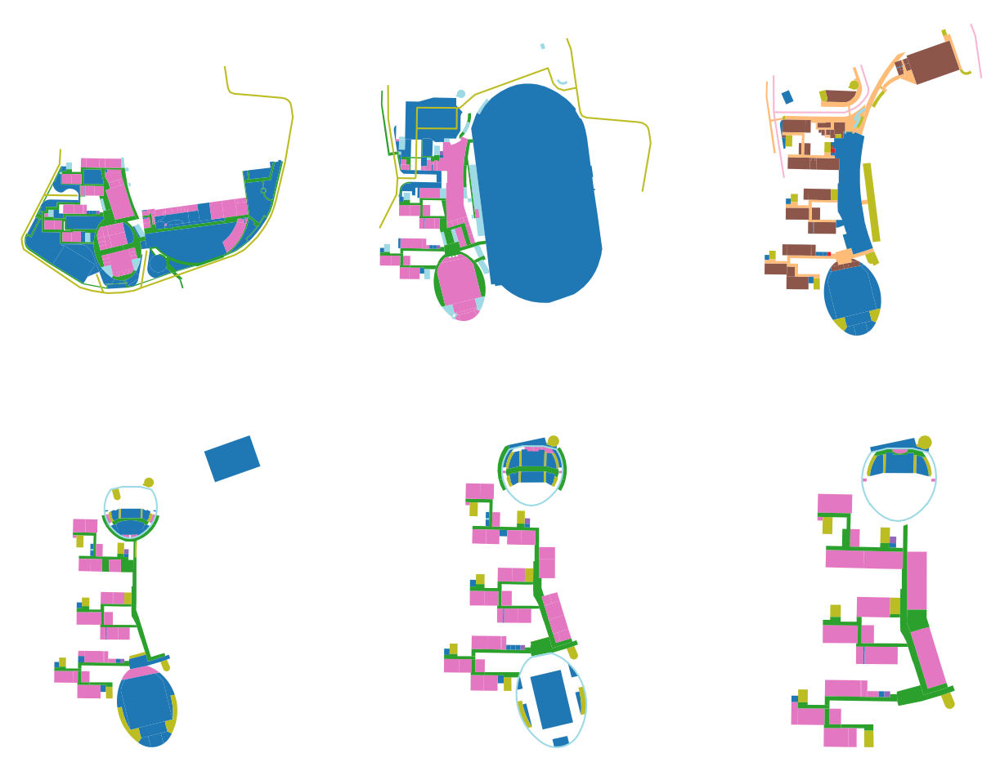
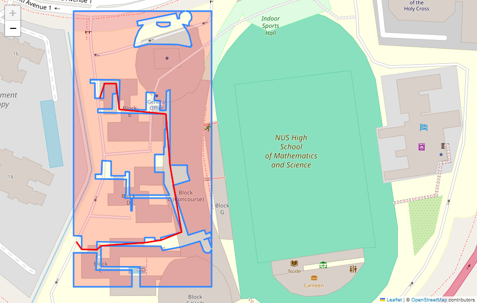
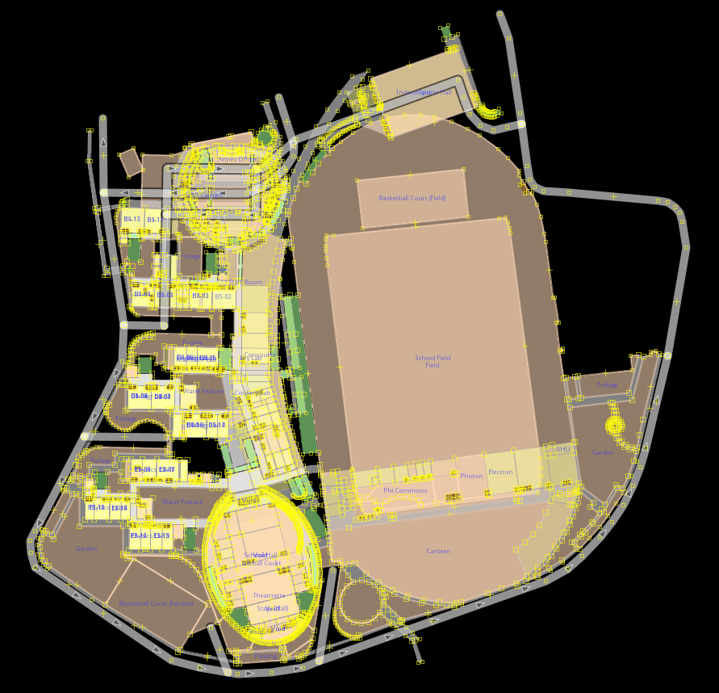

# AppVenture Pathfinding Project

Map by Level             |  Pathfinding
:-------------------------:|:-------------------------:
  |  

JOSM             |
:-------------------------:|

### Contributors
- Ashton (606)
- Theophilus (505)
- Justin (303)

### Scope
Create an application that will allow visitors to navigate between important landmarks, for example, from the front gate to the Library.
Future scope: Allow all NUSH staff and students to find the fastest route between two points.

### Roles:
Ashton: Pathfinding, Backend  
Theophilus: Mapping, Frontend  
Justin: Frontend

## Using JOSM
- Download JOSM and follow setup instructions: https://josm.openstreetmap.de/wiki/Download
- Go to Edit->Preferences->Plugins. Download the plugin list, and install the PicLayer and indoorhelper plugins
- Imagery -> New Picture Layer from file allows you to upload a plan. The plan can be manipulated with the left sidebar commands.
- Indoor Helper adds a utility sidebar for mapping with https://wiki.openstreetmap.org/wiki/Simple_Indoor_Tagging
- Caveats: the project file often corrupts with the background image layers (mapped nodes are unaffected). Currently trying to find a way to fix it. UPDATE: most crash/file corruption related issues were due to "repeat_on" tag being bugged. the map no longer uses this tag

## Map Tagging Schema
- Go to `docs/public/docs/index.md` for more information.